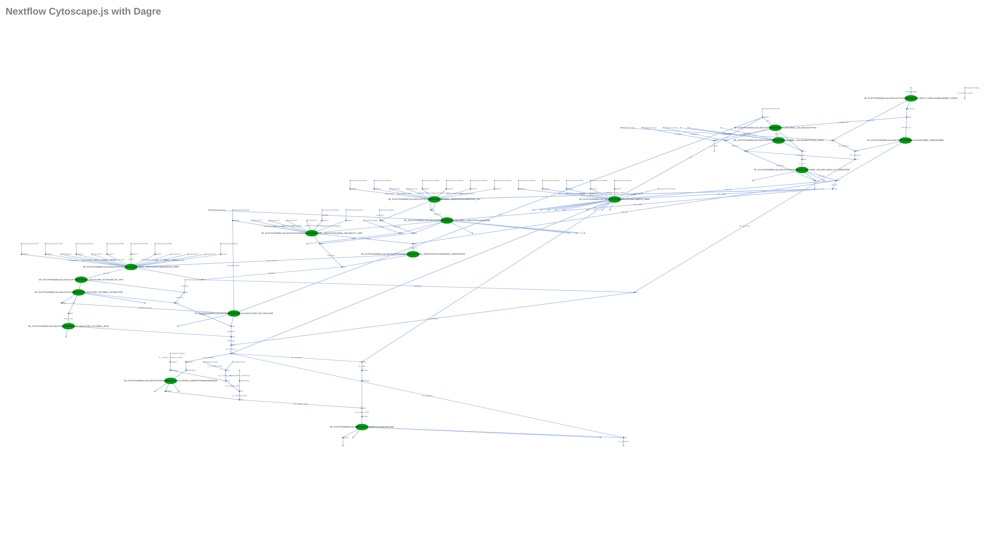

[](https://www.nextflow.io/)
[](https://www.docker.com/)
[](https://sylabs.io/docs/)

<p align="center">
    
</p>
<p align="right">
    
</p>
<p align="right">
    
</p>


## Introduction

**nf-platypusindelcalling**:A Platypus-based insertion/deletion-detection workflow with extensive quality control additions.  The workflow is based on DKFZ - ODCF OTP Indel Calling Pipeline.

For now, this workflow is only optimal to work in ODCF Cluster. The config file (conf/dkfz_cluster.config) can be used as an example. Running Annotation, DeepAnnotation, Filter and Tinda steps are optinal and can be turned off using [runIndelAnnotation, runIndelDeepAnnotation, runIndelVCFFilter, runTinda] parameters sequentialy.  

The pipeline is built using [Nextflow](https://www.nextflow.io), a workflow tool to run tasks across multiple compute infrastructures in a very portable manner. It uses Docker/Singularity containers making installation trivial and results highly reproducible. The [Nextflow DSL2](https://www.nextflow.io/docs/latest/dsl2.html) implementation of this pipeline uses one container per process which makes it much easier to maintain and update software dependencies.

This nextflow pipeline is the transition of [DKFZ-ODCF/IndelCallingWorkflow](https://github.com/DKFZ-ODCF/IndelCallingWorkflow). 

**Important Notice**: The whole workflow is only ready for DKFZ cluster users for now, It is strongly recommended to them to read whole documentation before usage. This workflow works better with nextflow/22.07.1-edge in the cluster, It is recommended to use >22.07.1. Only Indel Calling part can be used for outside users, reference file and chromsome length file must be given for this. 

## Pipeline summary


The pipeline has 6 main steps: Indel calling using platypus, basic annotations, deep annotations, filtering, sample swap check and multiqc report. 

1. Indel Calling: 
   
   Platypus ([`Platypus`](https://www.well.ox.ac.uk/research/research-groups/lunter-group/lunter-group/platypus-a-haplotype-based-variant-caller-for-next-generation-sequence-data))
   : Platypus tool is used to call variants using local realignmnets and local assemblies. It can detect SNPs, MNPs, short indels, replacements, deletions up to several kb. It can be both used with WGS and WES. The tool has been thoroughly tested on data mapped with Stampy and BWA.
2. Basic Annotations (--runIndelAnnotation True):

   In-house scripts to annotate with several databases like gnomAD, dbSNP, and ExAC.

   ANNOVAR ([`Annovar`](https://annovar.openbioinformatics.org/en/latest/))
   : annotate_variation.pl is used to annotate variants. The tool makes classifications for intergenic, intogenic, nonsynoymous SNP, frameshift deletion or large-scale duplication regions.
   
   Reliability and confidation annotations: It is an optional ste for mapability, hiseq, selfchain and repeat regions checks for reliability and confidence of those scores.

3. Deep Annotation (--runIndelDeepAnnotation True): 
   
   If basic annotations are applied, an extra optional step for number of extra indel annotations like enhancer, cosmic, mirBASE, encode databases can be applied too.

4. Filtering and Visualization (--runIndelVCFFilter True): 

   It is an optional step. Filtering is only required for the tumor samples with no-control and filtering can only be applied if basic annotation is performed. 

   Indel Extraction and Visualizations: INDELs can be extracted by certain minimum confidence level

   Visualization and json reports: Extracted INDELs are visualized and analytics of INDEL categories are reported as JSON.

5. Check Sample Swap (--runTinda True): 

   Canopy Based Clustering and Bias Filter, thi step can only be applied into the tumor samples with control. 

6. MultiQC (--skipmultiqc False):

   Produces pipeline level analytics and reports. 

## Quick Start

1. Install [`Nextflow`](https://www.nextflow.io/docs/latest/getstarted.html#installation) (`>=21.10.3`)

2. Install any of [`Docker`](https://docs.docker.com/engine/installation/) or [`Singularity`](https://www.sylabs.io/guides/3.0/user-guide/) (you can follow [this tutorial](https://singularity-tutorial.github.io/01-installation/))

3. Download [Annovar](https://annovar.openbioinformatics.org/en/latest/user-guide/download/) and set-up suitable annotation table directory to perform annotation. Example: 

 ```console
annotate_variation.pl -downdb wgEncodeGencodeBasicV19 humandb/ -build hg19
 ```

4. Download the pipeline and test it on a minimal dataset with a single command:

   ```console
   git clone https://github.com/ghga-de/nf-platypusindelcalling.git
    ```

  before run do this to bin directory, make it runnable!:

  ```console
  chmod +x bin/*
  ```

   ```console
   nextflow run main.nf -profile test,YOURPROFILE --outdir <OUTDIR> --input <SAMPLESHEET>
   ```

   Note that some form of configuration will be needed so that Nextflow knows how to fetch the required software. This is usually done in the form of a config profile (`YOURPROFILE` in the example command above). You can chain multiple config profiles in a comma-separated string.

   > - The pipeline comes with config profiles called `docker` and `singularity` which instruct the pipeline to use the named tool for software management. For example, `-profile test,docker`.
   > - Please check [nf-core/configs](https://github.com/nf-core/configs#documentation) to see if a custom config file to run nf-core pipelines already exists for your Institute. If so, you can simply use `-profile <institute>` in your command. This will enable either `docker` or `singularity` and set the appropriate execution settings for your local compute environment.
   > - If you are using `singularity`, please use the [`nf-core download`](https://nf-co.re/tools/#downloading-pipelines-for-offline-use) command to download images first, before running the pipeline. Setting the [`NXF_SINGULARITY_CACHEDIR` or `singularity.cacheDir`](https://www.nextflow.io/docs/latest/singularity.html?#singularity-docker-hub) Nextflow options enables you to store and re-use the images from a central location for future pipeline runs.

5. Simple test run

   ```console
   nextflow run main.nf --outdir results -profile singularity,dkfz_cluster_38
   ``` 

6. Start running your own analysis!

   <!-- TODO nf-core: Update the example "typical command" below used to run the pipeline -->

   ```console
   nextflow run main.nf --input samplesheet.csv --outdir <OUTDIR> -profile <docker/singularity> --config test/institute.config
   ```
   
## Samplesheet columns

**sample**: The sample name will be tagged to the job

**tumor**: The path to the tumor file

**control**: The path to the control file, if there is no control will be kept blank.

## Data Requirements

All VCF and BED files need to be indexed with tabix and should be in the same folder!

[This section is for further]


## Documentation

The nf-platypusindelcalling pipeline comes with documentation about the pipeline [usage](https://github.com/ghga-de/nf-platypusindelcalling/blob/main/docs/usage.md) and [output](https://github.com/ghga-de/nf-platypusindelcalling/blob/main/docs/output.md).

Please read [usage](https://github.com/ghga-de/nf-platypusindelcalling/blob/main/docs/usage.md) document to learn how to perform sample analysis provided with this repository!

<p align="center">
    
</p>

## Credits

nf-platypusindelcalling was originally written by Kuebra Narci kuebra.narci@dkfz-heidelberg.de.

The pipeline is originally written in workflow management language Roddy. [Inspired github page](https://github.com/DKFZ-ODCF/IndelCallingWorkflow)

We thank the following people for their extensive assistance in the development of this pipeline:

**TODO**
<!-- TODO nf-core: If applicable, make list of people who have also contributed -->

## Contributions and Support

If you would like to contribute to this pipeline, please see the [contributing guidelines](.github/CONTRIBUTING.md).

## Citations

<!-- If you use  nf-platypusindelcalling for your analysis, please cite it using the following doi: [10.5281/zenodo.XXXXXX](https://doi.org/10.5281/zenodo.XXXXXX) -->

<!-- TODO nf-core: Add bibliography of tools and data used in your pipeline -->

An extensive list of references for the tools used by the pipeline can be found in the [`CITATIONS.md`](CITATIONS.md) file.
